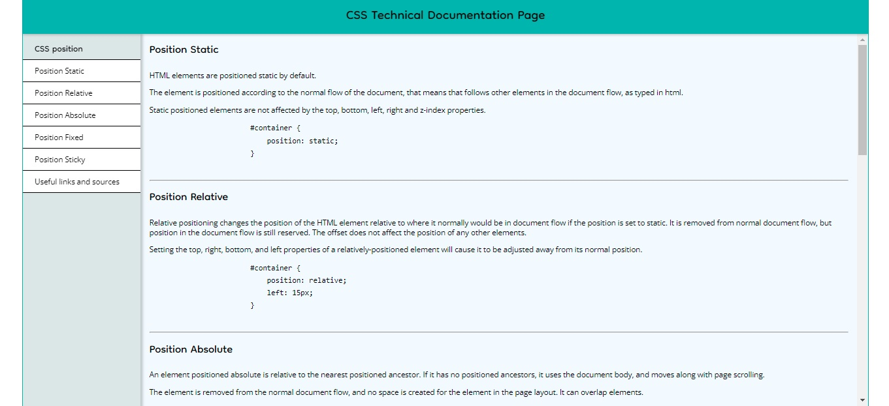
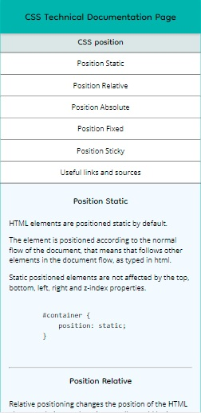

### freeCodeCamp > Responsive Web Design Projects

# Build a Technical Documentation Page

This is a solution to the freeCodeCamp's [Build a Technical Documentation Page](https://www.freecodecamp.org/learn/responsive-web-design/responsive-web-design-projects/build-a-technical-documentation-page) project. Projects are ment to apply all of the skills, principles, and concepts learned so far: HTML, CSS, Visual Design, Accessibility, and more.

## Table of contents

- [Overview](#overview)
  - [The challenge](#the-challenge)
  - [Screenshot](#screenshot)
  - [Links](#links)
- [My process](#my-process)
  - [Built with](#built-with)
  - [What I learned](#what-i-learned)
  - [Continued development](#continued-development)
  - [Useful resources](#useful-resources)
- [Author](#author)
- [Acknowledgments](#acknowledgments)

## Overview

### The challenge
- Users complete 15 User Stories to pass the test
- Users can use HTML, JavaScript, and CSS to complete this project
- Plain CSS is recommended

### Screenshot

| Desktop layout |
|:--:|



| Mobile layout |
|:--:|


### Links

- Solution URL: https://github.com/PavlinaPs/Project4-Technical-Documentation-Page
- Live Site URL: https://pavlinaps.github.io/Project4-Technical-Documentation-Page/

## My process

### Built with

- Semantic HTML5 markup
- Flexbox
- \<code> element
- \<pre> element

### What I learned

In this challenge I learned how to use the Inline Code element: 
- \<code> element indicates that the text is a short fragment of computer code
- short means a single phrase of code or line of code
- to represent multiple lines of code, needs to be wrapped within a \<pre> element
- uses default monospace font
- a CSS rule can be used to override the default font

```html
<pre>
  <code>
    #container {
      position: static;
    }
  </code>
</pre>
```
I couldn't figure out, where does the margin come from, it turned out, from the Preformatted Text element, hence from where exactly it is written in the HTML:
- \<pre> HTML element represents preformatted text which is to be presented exactly as written in the HTML file
-  whitespace inside this element is displayed as written

The theory is copied from MDN. Links are below.

### Continued development
Maybe I add a hamburger menu for the mobile layout in the future. I will also add a link, if I use a position sticky in a real project.

### Useful resources
MDN on \<code>: https://developer.mozilla.org/en-US/docs/Web/HTML/Element/code
MDN on \<pre>: https://developer.mozilla.org/en-US/docs/Web/HTML/Element/pre

## Author

- GitHub - [PavlinaPs](https://github.com/PavlinaPs)
- Frontend Mentor - [@PavlinaPs](https://www.frontendmentor.io/profile/PavlinaPs)

## Acknowledgments

I would like to say a big Thank You to freeCodeCamp for everyting they do and for all I have already learned from them. And also MDS for their endless help.
